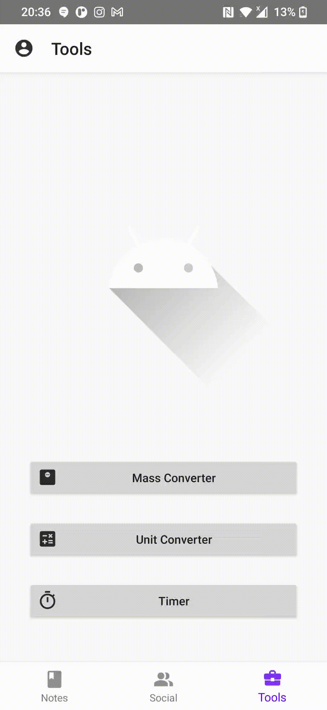

<!-- PROJECT SHIELDS -->
[![LinkedIn][linkedin-shield]][linkedin-url]

<!-- PROJECT LOGO -->
 

  

<h3 align="center">Foodity</h3>

  

    An Android application for writing down all sorts of cooking   notes or original recipes and sharing them with friends
     
     
    <b><a href="#demo">View Demo</a></b>
  

<!-- ABOUT THE PROJECT -->
## About The Project

The project provides its users with flexible tools for defining cooking notes - they can be anything: recipes, tea brewing instructions, favourite snack, fancy knife collection - whatever your heart desires! Notes are grouped into categories. The application lets you browse through other users' notes. You can follow other users to see their latest activity. Additionaly users are provided with built-in kitchen tools like a timer or a unit converter to help with cooking.

The project has been implemented as a part of the engineering thesis "Foodity - A Social Kitchen Assistant".

(<a href="#top">back to top</a>)

### Built With

* [Kotlin](https://developer.android.com/kotlin)
* [Spring Boot](https://spring.io/projects/spring-boot)
* [Hibernate](https://hibernate.org/)
* [SQLite](https://www.sqlite.org/index.html)
* [Hilt](https://developer.android.com/training/dependency-injection/hilt-android)
* [Retrofit](https://square.github.io/retrofit/)
* [Kotlin Coroutines](https://developer.android.com/kotlin/coroutines)
* [Android View Binding](https://developer.android.com/topic/libraries/view-binding)
* [Android Data Binding](https://developer.android.com/topic/libraries/data-binding)
* [Espresso](https://developer.android.com/training/testing/espresso)

(<a href="#top">back to top</a>)

<!-- DEMO -->
## Demo

 
Edit your cooking notes in any way you want. A cooking note can be made out of three types of elements: text, list and image. You can upload any image from your device's memory.
                           

Follow your friends' accounts, watch their activity and browse through their notes collection.
                           

Use built-in tools for converting different types of units from all over the world. Spare yourself some kitchen tools and use a scale only!
                           

(<a href="#top">back to top</a>)

<!-- CONTACT -->
## Contact

Bartłomiej Pedryc - b.pedryc11@gmail.com

(<a href="#top">back to top</a>)

<!-- MARKDOWN LINKS & IMAGES -->
<!-- https://www.markdownguide.org/basic-syntax/#reference-style-links -->

[contributors-shield]: https://img.shields.io/github/contributors/github_username/repo_name.svg?style=for-the-badge
[contributors-url]: https://github.com/github_username/repo_name/graphs/contributors
[forks-shield]: https://img.shields.io/github/forks/github_username/repo_name.svg?style=for-the-badge
[forks-url]: https://github.com/github_username/repo_name/network/members
[stars-shield]: https://img.shields.io/github/stars/github_username/repo_name.svg?style=for-the-badge
[stars-url]: https://github.com/github_username/repo_name/stargazers
[issues-shield]: https://img.shields.io/github/issues/github_username/repo_name.svg?style=for-the-badge
[issues-url]: https://github.com/github_username/repo_name/issues
[license-shield]: https://img.shields.io/github/license/github_username/repo_name.svg?style=for-the-badge
[license-url]: https://github.com/github_username/repo_name/blob/master/LICENSE.txt
[linkedin-shield]: https://img.shields.io/badge/-LinkedIn-black.svg?style=for-the-badge&logo=linkedin&colorB=555
[linkedin-url]: https://www.linkedin.com/in/bart%C5%82omiej-pedryc-944800191
[product-screenshot]: ./note_preview.png
